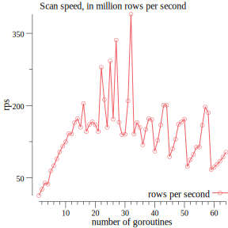

# benchmark results

Table: scan speed depending on spawned goroutines
|goroutines|rows per second|duration|total rows
|-----------|-----|----|----|
|1|13117999.62|1m16.231135002s|1000000000
|2|26192143.57|38.179387544s|1000000000
|3|39233219.64|25.488604022s|1000000000
|4|36694638.01|27.251938001s|1000000000
|5|64427832.78|15.521242247s|1000000000
|6|75063811.53|13.321998705s|1000000000
|7|89382466.50|11.18787654s|1000000000
|8|103697239.19|9.643458281s|1000000000
|9|115863579.04|8.630839892s|1000000000
|10|124711645.24|8.018497375s|1000000000
|11|141643961.62|7.059955035s|1000000000
|12|140982851.39|7.093061249s|1000000000
|13|164454852.56|6.080696218s|1000000000
|14|172850712.92|5.78533917s|1000000000
|15|155174236.64|6.444368741s|1000000000
|16|204420482.42|4.891877703s|1000000000
|17|145831632.33|6.85722284s|1000000000
|18|160604971.43|6.22645732s|1000000000
|19|166148336.94|6.018718083s|1000000000
|20|160121072.92|6.245274165s|1000000000
|21|145932771.95|6.852470399s|1000000000
|22|279466166.80|3.578250675s|1000000000
|23|212394015.08|4.708230595s|1000000000
|24|154801932.46|6.459867678s|1000000000
|25|292429811.60|3.419623993s|1000000000
|26|171785324.70|5.821219023s|1000000000
|27|335972050.20|2.976438068s|1000000000
|28|165209702.18|6.052913278s|1000000000
|29|139478300.98|7.169573998s|1000000000
|30|140377315.45|7.123658098s|1000000000
|31|209808845.03|4.766243291s|1000000000
|32|389727345.27|2.56589642s|1000000000
|33|140821014.33|7.101212875s|1000000000
|34|164882154.04|6.064937748s|1000000000
|35|154566380.32|6.469712223s|1000000000
|36|118449970.85|8.442382829s|1000000000
|37|150378898.38|6.649869169s|1000000000
|38|172797081.01|5.787134795s|1000000000
|39|170725961.86|5.857339968s|1000000000
|40|105202314.80|9.505494265s|1000000000
|41|127752769.33|7.827618965s|1000000000
|42|159795536.29|6.257997083s|1000000000
|43|200811100.13|4.9798044s|1000000000
|44|200962472.91|4.976053417s|1000000000
|45|93821873.12|10.658495367s|1000000000
|46|110181379.50|9.075943726s|1000000000
|47|130087755.47|7.687118564s|1000000000
|48|161093330.46|6.207581637s|1000000000
|49|165951108.11|6.025871182s|1000000000
|50|171681227.12|5.824748674s|1000000000
|51|73285410.95|13.64528065s|1000000000
|52|87709433.17|11.401282209s|1000000000
|53|98430180.78|10.159485557s|1000000000
|54|113419911.02|8.81679408s|1000000000
|55|113858495.80|8.782831645s|1000000000
|56|159036284.47|6.287873257s|1000000000
|57|196940066.87|5.077686912s|1000000000
|58|185159825.52|5.400739589s|1000000000
|59|67097556.82|14.903672315s|1000000000
|60|72079855.83|13.873501666s|1000000000
|61|77807092.24|12.852298822s|1000000000
|62|84684669.08|11.808512814s|1000000000
|63|93164153.20|10.733742171s|1000000000
|64|103273113.24|9.683062402s|1000000000

## node specification

The benchmark has been run on 'ams1-c2.large.arm-01', which has the following specification:

Table: memory specification
|Property|Value|
|-----------|-----|
|total_physical_bytes|137170518016|
|total_usable_bytes|134517387264|
|supported_page_sizes|[1.073741824e+09 2.097152e+06 3.3554432e+07 65536]|
Table: cpu specification
|Property|Value|
|-----------|-----|
|total_cores|0|
|total_threads|0|
|processors|[]|
Table: storage specification
|Property|Value|
|-----------|-----|
|removable|false|
|bus_path|platform-APMC0D33:00-ata-1|
|serial_number|190920EC6A57|
|wwn|0x500a075120ec6a57|
|partitions|[map[label: mount_point:/boot/efi name:sda1 read_only:false size_bytes:5.24288e+08 type:vfat] map[label: mount_point: name:sda2 read_only:true size_bytes:4.80103936e+09 type:] map[label: mount_point:/ name:sda3 read_only:false size_bytes:4.7477719808e+11 type:ext4]]|
|name|sda|
|size_bytes|480103981056|
|storage_controller|scsi|
|vendor|ATA|
|model|Micron_5200_MTFD|
|physical_block_size_bytes|4096|
|drive_type|ssd|

|Property|Value|
|-----------|-----|
|drive_type|hdd|
|storage_controller|scsi|
|bus_path|platform-808622B7:00-usb-0:1.2:1.0-scsi-0:0:0:0|
|model|Virtual_HDisk0|
|serial_number|AAAABBBBCCCC3|
|partitions|[]|
|physical_block_size_bytes|512|
|size_bytes|0|
|removable|true|
|vendor|AMI|
|wwn|unknown|
|name|sdb|

|Property|Value|
|-----------|-----|
|serial_number|AAAABBBBCCCC1|
|name|sr0|
|size_bytes|1073741312|
|physical_block_size_bytes|512|
|drive_type|odd|
|removable|true|
|storage_controller|scsi|
|vendor|AMI|
|bus_path|platform-808622B7:00-usb-0:1.1:1.0-scsi-0:0:0:0|
|model|Virtual_CDROM0|
|wwn|unknown|
|partitions|[]|

## histogram data of test set

The task was to calculate a histogram from the test set. In total, 1000000000 rows have been scanned.
|Temperature|Count|
|-----------|-----|
|0|3921916|
|1|3921617|
|2|3918919|
|3|3921911|
|4|3922040|
|5|3919686|
|6|3921700|
|7|3924892|
|8|3924598|
|9|3919605|
|10|3923605|
|11|3921916|
|12|3923619|
|13|3921132|
|14|3922901|
|15|3920332|
|16|3918880|
|17|3921500|
|18|3918621|
|19|3922566|
|20|3922029|
|21|3923813|
|22|3920018|
|23|3918197|
|24|3926740|
|25|3920777|
|26|3921208|
|27|3922257|
|28|3920019|
|29|3921472|
|30|3921196|
|31|3920469|
|32|3918013|
|33|3920631|
|34|3924732|
|35|3921994|
|36|3922816|
|37|3920412|
|38|3924500|
|39|3921858|
|40|3921210|
|41|3916716|
|42|3919869|
|43|3921877|
|44|3920457|
|45|3919895|
|46|3918674|
|47|3920129|
|48|3923621|
|49|3923586|
|50|3921013|
|51|3924199|
|52|3922239|
|53|3925536|
|54|3918199|
|55|3920048|
|56|3922301|
|57|3922666|
|58|3918639|
|59|3925105|
|60|3920333|
|61|3922255|
|62|3923047|
|63|3924147|
|64|3921428|
|65|3921873|
|66|3922446|
|67|3920141|
|68|3925338|
|69|3922974|
|70|3922983|
|71|3921543|
|72|3919411|
|73|3921178|
|74|3923284|
|75|3923071|
|76|3921104|
|77|3921960|
|78|3923634|
|79|3920621|
|80|3925134|
|81|3921749|
|82|3917923|
|83|3922565|
|84|3921027|
|85|3921320|
|86|3921408|
|87|3923175|
|88|3922694|
|89|3922130|
|90|3921597|
|91|3920720|
|92|3922047|
|93|3918717|
|94|3918834|
|95|3920276|
|96|3924922|
|97|3921190|
|98|3919438|
|99|3922734|
|100|3921502|
|101|3920421|
|102|3922244|
|103|3919996|
|104|3918738|
|105|3918710|
|106|3918534|
|107|3923321|
|108|3923304|
|109|3922762|
|110|3923134|
|111|3924424|
|112|3919332|
|113|3921057|
|114|3919749|
|115|3921112|
|116|3920175|
|117|3924326|
|118|3920251|
|119|3916903|
|120|3923074|
|121|3921244|
|122|3921170|
|123|3920812|
|124|3922845|
|125|3921364|
|126|3920034|
|127|3923915|
|-128|3921709|
|-127|3919116|
|-126|3920484|
|-125|3921941|
|-124|3921978|
|-123|3922349|
|-122|3919545|
|-121|3918678|
|-120|3921756|
|-119|3920113|
|-118|3921660|
|-117|3921395|
|-116|3920469|
|-115|3922294|
|-114|3922493|
|-113|3918576|
|-112|3925564|
|-111|3919981|
|-110|3922463|
|-109|3920226|
|-108|3922365|
|-107|3920597|
|-106|3922804|
|-105|3920201|
|-104|3924483|
|-103|3919630|
|-102|3923429|
|-101|3922302|
|-100|3920769|
|-99|3926547|
|-98|3924324|
|-97|3921031|
|-96|3921341|
|-95|3923242|
|-94|3923691|
|-93|3921067|
|-92|3921921|
|-91|3919849|
|-90|3921346|
|-89|3916790|
|-88|3921924|
|-87|3920274|
|-86|3919467|
|-85|3921204|
|-84|3920254|
|-83|3922473|
|-82|3918583|
|-81|3919470|
|-80|3921516|
|-79|3919096|
|-78|3922228|
|-77|3922219|
|-76|3923021|
|-75|3924648|
|-74|3920441|
|-73|3920029|
|-72|3920067|
|-71|3919730|
|-70|3924485|
|-69|3921680|
|-68|3920093|
|-67|3921203|
|-66|3920266|
|-65|3922799|
|-64|3923439|
|-63|3918239|
|-62|3920230|
|-61|3921020|
|-60|3921150|
|-59|3922307|
|-58|3918227|
|-57|3919706|
|-56|3917559|
|-55|3925105|
|-54|3921975|
|-53|3925263|
|-52|3921183|
|-51|3923901|
|-50|3922520|
|-49|3920877|
|-48|3919437|
|-47|3919548|
|-46|3921687|
|-45|3922248|
|-44|3922331|
|-43|3921121|
|-42|3925906|
|-41|3921925|
|-40|3921148|
|-39|3918702|
|-38|3920906|
|-37|3924122|
|-36|3924744|
|-35|3922815|
|-34|3922091|
|-33|3920078|
|-32|3919599|
|-31|3923601|
|-30|3923035|
|-29|3926751|
|-28|3924875|
|-27|3921631|
|-26|3918379|
|-25|3920911|
|-24|3922682|
|-23|3919398|
|-22|3922643|
|-21|3919926|
|-20|3920611|
|-19|3921508|
|-18|3922560|
|-17|3919839|
|-16|3920333|
|-15|3918346|
|-14|3922629|
|-13|3919099|
|-12|3924003|
|-11|3923784|
|-10|3919995|
|-9|3922064|
|-8|3922320|
|-7|3925474|
|-6|3925501|
|-5|3925626|
|-4|3921426|
|-3|3922038|
|-2|3922304|
|-1|0|
