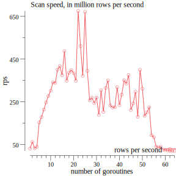

# benchmark results

Table: scan speed depending on spawned goroutines
|goroutines|rows per second|duration|total rows
|-----------|-----|----|----|
|1|31200429.94|32.050840387s|1000000000
|2|62326822.25|16.044456687s|1000000000
|3|32589493.09|30.684736254s|1000000000
|4|39818614.48|25.113882365s|1000000000
|5|153414926.49|6.518270568s|1000000000
|6|178379078.91|5.60603859s|1000000000
|7|213096809.06|4.692702835s|1000000000
|8|247266806.19|4.044214488s|1000000000
|9|277305913.50|3.606125767s|1000000000
|10|301940571.42|3.311910007s|1000000000
|11|340903697.31|2.933379743s|1000000000
|12|338560973.88|2.953677704s|1000000000
|13|400653032.55|2.495925199s|1000000000
|14|417004102.22|2.398057944s|1000000000
|15|374512294.92|2.670139308s|1000000000
|16|487637006.27|2.050705724s|1000000000
|17|348925081.78|2.865944732s|1000000000
|18|386484042.09|2.587428952s|1000000000
|19|398884190.88|2.506993315s|1000000000
|20|384802660.08|2.598734634s|1000000000
|21|348613007.64|2.868510291s|1000000000
|22|675509323.75|1.480364467s|1000000000
|23|511231692.81|1.956060264s|1000000000
|24|371918585.62|2.688760494s|1000000000
|25|671221011.31|1.489822254s|1000000000
|26|394920018.53|2.532158293s|1000000000
|27|257472550.46|3.883909171s|1000000000
|28|269462737.57|3.711088253s|1000000000
|29|244236848.42|4.094386275s|1000000000
|30|270088836.49|3.702485497s|1000000000
|31|189366149.01|5.280774865s|1000000000
|32|304380951.54|3.285356705s|1000000000
|33|202950930.27|4.927299415s|1000000000
|34|315054218.69|3.174056847s|1000000000
|35|350455758.25|2.85342722s|1000000000
|36|232967735.61|4.292439884s|1000000000
|37|223639308.88|4.471485827s|1000000000
|38|224763064.88|4.449129578s|1000000000
|39|318383964.81|3.140861697s|1000000000
|40|234804865.25|4.258855535s|1000000000
|41|283840890.91|3.523100554s|1000000000
|42|350515984.78|2.852936937s|1000000000
|43|335399937.84|2.981515162s|1000000000
|44|375554050.01|2.662732568s|1000000000
|45|211983336.66|4.717351919s|1000000000
|46|242232831.68|4.128259547s|1000000000
|47|296981417.47|3.367214045s|1000000000
|48|179788559.56|5.56208917s|1000000000
|49|400072623.10|2.499546188s|1000000000
|50|311395314.13|3.211352113s|1000000000
|51|184254534.13|5.427274855s|1000000000
|52|200636252.43|4.984144131s|1000000000
|53|224439509.97|4.455543501s|1000000000
|54|93036193.95|10.748505045s|1000000000
|55|84389918.33|11.849756699s|1000000000
|56|40136714.74|24.914844337s|1000000000
|57|35778411.66|27.949815367s|1000000000
|58|39801132.18|25.124913421s|1000000000
|59|25757037.56|38.824340632s|1000000000
|60|24070674.78|41.544327661s|1000000000
|61|23104786.94|43.281074282s|1000000000
|62|19826985.76|50.436309989s|1000000000
|63|20133006.64|49.669680147s|1000000000
|64|20258695.74|49.361519263s|1000000000

## node specification

The benchmark has been run on 'ams1-c3.medium.x86-01', which has the following specification:

Table: memory specification
|Property|Value|
|-----------|-----|
|total_physical_bytes|68296212480|
|total_usable_bytes|67089072128|
|supported_page_sizes|[1.073741824e+09 2.097152e+06]|
Table: cpu specification
|Property|Value|
|-----------|-----|
|total_cores|24|
|total_threads|24|
|processors|[map[capabilities:[fpu vme de pse tsc msr pae mce cx8 apic sep mtrr pge mca cmov pat pse36 clflush mmx fxsr sse sse2 ht syscall nx mmxext fxsr_opt pdpe1gb rdtscp lm constant_tsc rep_good nopl nonstop_tsc cpuid extd_apicid aperfmperf pni pclmulqdq monitor ssse3 fma cx16 sse4_1 sse4_2 x2apic movbe popcnt aes xsave avx f16c rdrand lahf_lm cmp_legacy svm extapic cr8_legacy abm sse4a misalignsse 3dnowprefetch osvw ibs skinit wdt tce topoext perfctr_core perfctr_nb bpext perfctr_llc mwaitx cpb cat_l3 cdp_l3 hw_pstate sme ssbd mba sev ibrs ibpb stibp vmmcall fsgsbase bmi1 avx2 smep bmi2 cqm rdt_a rdseed adx smap clflushopt clwb sha_ni xsaveopt xsavec xgetbv1 xsaves cqm_llc cqm_occup_llc cqm_mbm_total cqm_mbm_local clzero irperf xsaveerptr wbnoinvd arat npt lbrv svm_lock nrip_save tsc_scale vmcb_clean flushbyasid decodeassists pausefilter pfthreshold avic v_vmsave_vmload vgif umip rdpid overflow_recov succor smca] cores:[map[id:0 index:0 logical_processors:[0] total_threads:1] map[id:1 index:1 logical_processors:[1] total_threads:1] map[id:2 index:2 logical_processors:[2] total_threads:1] map[id:4 index:3 logical_processors:[3] total_threads:1] map[id:5 index:4 logical_processors:[4] total_threads:1] map[id:6 index:5 logical_processors:[5] total_threads:1] map[id:8 index:6 logical_processors:[6] total_threads:1] map[id:9 index:7 logical_processors:[7] total_threads:1] map[id:10 index:8 logical_processors:[8] total_threads:1] map[id:12 index:9 logical_processors:[9] total_threads:1] map[id:13 index:10 logical_processors:[10] total_threads:1] map[id:14 index:11 logical_processors:[11] total_threads:1] map[id:16 index:12 logical_processors:[12] total_threads:1] map[id:17 index:13 logical_processors:[13] total_threads:1] map[id:18 index:14 logical_processors:[14] total_threads:1] map[id:20 index:15 logical_processors:[15] total_threads:1] map[id:21 index:16 logical_processors:[16] total_threads:1] map[id:22 index:17 logical_processors:[17] total_threads:1] map[id:24 index:18 logical_processors:[18] total_threads:1] map[id:25 index:19 logical_processors:[19] total_threads:1] map[id:26 index:20 logical_processors:[20] total_threads:1] map[id:28 index:21 logical_processors:[21] total_threads:1] map[id:29 index:22 logical_processors:[22] total_threads:1] map[id:30 index:23 logical_processors:[23] total_threads:1]] id:0 model:AMD EPYC 7402P 24-Core Processor total_cores:24 total_threads:24 vendor:AuthenticAMD]]|
Table: storage specification
|Property|Value|
|-----------|-----|
|drive_type|ssd|
|removable|false|
|storage_controller|scsi|
|bus_path|pci-0000:01:00.0-sas-phy4-lun-0|
|vendor|ATA|
|name|sda|
|size_bytes|480103981056|
|physical_block_size_bytes|4096|
|wwn|0x5002538e19b49777|
|model|MZ7LH480HAHQ0D3|
|serial_number|5002538e19b49777|
|partitions|[]|

|Property|Value|
|-----------|-----|
|removable|false|
|storage_controller|scsi|
|vendor|ATA|
|serial_number|5002538e19b4979b|
|wwn|0x5002538e19b4979b|
|partitions|[]|
|physical_block_size_bytes|4096|
|drive_type|ssd|
|bus_path|pci-0000:01:00.0-sas-phy0-lun-0|
|model|MZ7LH480HAHQ0D3|
|name|sdb|
|size_bytes|480103981056|

|Property|Value|
|-----------|-----|
|removable|false|
|bus_path|pci-0000:c3:00.0-ata-1|
|model|MTFDDAV240TCB|
|serial_number|194825356C2A|
|wwn|0x500a075125356c2a|
|partitions|[]|
|name|sdc|
|physical_block_size_bytes|4096|
|drive_type|ssd|
|storage_controller|scsi|
|vendor|ATA|
|size_bytes|240057409536|

|Property|Value|
|-----------|-----|
|size_bytes|240057409536|
|physical_block_size_bytes|4096|
|removable|false|
|bus_path|pci-0000:c3:00.0-ata-2|
|vendor|ATA|
|model|MTFDDAV240TCB|
|name|sdd|
|drive_type|ssd|
|storage_controller|scsi|
|serial_number|194825357136|
|wwn|0x500a075125357136|
|partitions|[map[label: mount_point: name:sdd1 read_only:true size_bytes:2.097152e+06 type:] map[label: mount_point: name:sdd2 read_only:true size_bytes:2.0447232e+09 type:] map[label: mount_point:/ name:sdd3 read_only:false size_bytes:2.38009523712e+11 type:ext4]]|

|Property|Value|
|-----------|-----|
|removable|true|
|storage_controller|scsi|
|bus_path|pci-0000:48:00.3-usb-0:1.1.2:1.0-scsi-0:0:0:0|
|wwn|unknown|
|partitions|[]|
|serial_number|20180726-0|
|name|sde|
|size_bytes|0|
|physical_block_size_bytes|512|
|drive_type|hdd|
|vendor|Linux|
|model|MAS022|

## histogram data of test set

The task was to calculate a histogram from the test set. In total, 1000000000 rows have been scanned.
|Temperature|Count|
|-----------|-----|
|0|3921916|
|1|3921617|
|2|3918919|
|3|3921911|
|4|3922040|
|5|3919686|
|6|3921700|
|7|3924892|
|8|3924598|
|9|3919605|
|10|3923605|
|11|3921916|
|12|3923619|
|13|3921132|
|14|3922901|
|15|3920332|
|16|3918880|
|17|3921500|
|18|3918621|
|19|3922566|
|20|3922029|
|21|3923813|
|22|3920018|
|23|3918197|
|24|3926740|
|25|3920777|
|26|3921208|
|27|3922257|
|28|3920019|
|29|3921472|
|30|3921196|
|31|3920469|
|32|3918013|
|33|3920631|
|34|3924732|
|35|3921994|
|36|3922816|
|37|3920412|
|38|3924500|
|39|3921858|
|40|3921210|
|41|3916716|
|42|3919869|
|43|3921877|
|44|3920457|
|45|3919895|
|46|3918674|
|47|3920129|
|48|3923621|
|49|3923586|
|50|3921013|
|51|3924199|
|52|3922239|
|53|3925536|
|54|3918199|
|55|3920048|
|56|3922301|
|57|3922666|
|58|3918639|
|59|3925105|
|60|3920333|
|61|3922255|
|62|3923047|
|63|3924147|
|64|3921428|
|65|3921873|
|66|3922446|
|67|3920141|
|68|3925338|
|69|3922974|
|70|3922983|
|71|3921543|
|72|3919411|
|73|3921178|
|74|3923284|
|75|3923071|
|76|3921104|
|77|3921960|
|78|3923634|
|79|3920621|
|80|3925134|
|81|3921749|
|82|3917923|
|83|3922565|
|84|3921027|
|85|3921320|
|86|3921408|
|87|3923175|
|88|3922694|
|89|3922130|
|90|3921597|
|91|3920720|
|92|3922047|
|93|3918717|
|94|3918834|
|95|3920276|
|96|3924922|
|97|3921190|
|98|3919438|
|99|3922734|
|100|3921502|
|101|3920421|
|102|3922244|
|103|3919996|
|104|3918738|
|105|3918710|
|106|3918534|
|107|3923321|
|108|3923304|
|109|3922762|
|110|3923134|
|111|3924424|
|112|3919332|
|113|3921057|
|114|3919749|
|115|3921112|
|116|3920175|
|117|3924326|
|118|3920251|
|119|3916903|
|120|3923074|
|121|3921244|
|122|3921170|
|123|3920812|
|124|3922845|
|125|3921364|
|126|3920034|
|127|3923915|
|-128|3921709|
|-127|3919116|
|-126|3920484|
|-125|3921941|
|-124|3921978|
|-123|3922349|
|-122|3919545|
|-121|3918678|
|-120|3921756|
|-119|3920113|
|-118|3921660|
|-117|3921395|
|-116|3920469|
|-115|3922294|
|-114|3922493|
|-113|3918576|
|-112|3925564|
|-111|3919981|
|-110|3922463|
|-109|3920226|
|-108|3922365|
|-107|3920597|
|-106|3922804|
|-105|3920201|
|-104|3924483|
|-103|3919630|
|-102|3923429|
|-101|3922302|
|-100|3920769|
|-99|3926547|
|-98|3924324|
|-97|3921031|
|-96|3921341|
|-95|3923242|
|-94|3923691|
|-93|3921067|
|-92|3921921|
|-91|3919849|
|-90|3921346|
|-89|3916790|
|-88|3921924|
|-87|3920274|
|-86|3919467|
|-85|3921204|
|-84|3920254|
|-83|3922473|
|-82|3918583|
|-81|3919470|
|-80|3921516|
|-79|3919096|
|-78|3922228|
|-77|3922219|
|-76|3923021|
|-75|3924648|
|-74|3920441|
|-73|3920029|
|-72|3920067|
|-71|3919730|
|-70|3924485|
|-69|3921680|
|-68|3920093|
|-67|3921203|
|-66|3920266|
|-65|3922799|
|-64|3923439|
|-63|3918239|
|-62|3920230|
|-61|3921020|
|-60|3921150|
|-59|3922307|
|-58|3918227|
|-57|3919706|
|-56|3917559|
|-55|3925105|
|-54|3921975|
|-53|3925263|
|-52|3921183|
|-51|3923901|
|-50|3922520|
|-49|3920877|
|-48|3919437|
|-47|3919548|
|-46|3921687|
|-45|3922248|
|-44|3922331|
|-43|3921121|
|-42|3925906|
|-41|3921925|
|-40|3921148|
|-39|3918702|
|-38|3920906|
|-37|3924122|
|-36|3924744|
|-35|3922815|
|-34|3922091|
|-33|3920078|
|-32|3919599|
|-31|3923601|
|-30|3923035|
|-29|3926751|
|-28|3924875|
|-27|3921631|
|-26|3918379|
|-25|3920911|
|-24|3922682|
|-23|3919398|
|-22|3922643|
|-21|3919926|
|-20|3920611|
|-19|3921508|
|-18|3922560|
|-17|3919839|
|-16|3920333|
|-15|3918346|
|-14|3922629|
|-13|3919099|
|-12|3924003|
|-11|3923784|
|-10|3919995|
|-9|3922064|
|-8|3922320|
|-7|3925474|
|-6|3925501|
|-5|3925626|
|-4|3921426|
|-3|3922038|
|-2|3922304|
|-1|0|
