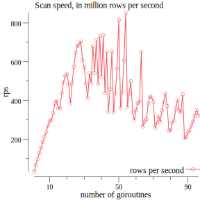

# benchmark results

Table: scan speed depending on spawned goroutines
|goroutines|rows per second|duration|total rows
|-----------|-----|----|----|
|1|33530462.78|59.647253102s|2000000000
|2|66852857.43|29.916447509s|2000000000
|3|97653383.52|20.480601163s|2000000000
|4|127927803.33|15.633818044s|2000000000
|5|156556784.12|12.774917492s|2000000000
|6|186256480.36|10.737881421s|2000000000
|7|214124468.52|9.340361771s|2000000000
|8|237477798.45|8.421839907s|2000000000
|9|270299051.24|7.399212061s|2000000000
|10|292743783.31|6.831912799s|2000000000
|11|299005665.66|6.688836466s|2000000000
|12|334314258.79|5.982395149s|2000000000
|13|383926335.41|5.209332665s|2000000000
|14|399131564.27|5.010879066s|2000000000
|15|358494577.08|5.578884948s|2000000000
|16|359743251.92|5.559520545s|2000000000
|17|439491188.79|4.550716945s|2000000000
|18|493946450.51|4.049021909s|2000000000
|19|527754133.78|3.789643457s|2000000000
|20|535188127.55|3.737003676s|2000000000
|21|482460570.06|4.145416484s|2000000000
|22|385476314.24|5.188386228s|2000000000
|23|488352029.57|4.095406344s|2000000000
|24|573573152.27|3.486913556s|2000000000
|25|645590930.88|3.097936951s|2000000000
|26|681903684.02|2.93296553s|2000000000
|27|687554237.35|2.908861427s|2000000000
|28|703761723.06|2.841870955s|2000000000
|29|607455551.16|3.292421966s|2000000000
|30|571044702.45|3.502352778s|2000000000
|31|486089517.58|4.114468483s|2000000000
|32|412296609.07|4.850876665s|2000000000
|33|539938727.75|3.704124s|2000000000
|34|488040683.71|4.098019011s|2000000000
|35|680029668.78|2.941048151s|2000000000
|36|542256630.06|3.688290542s|2000000000
|37|711586997.47|2.810619091s|2000000000
|38|484756307.35|4.125784378s|2000000000
|39|731333875.88|2.734729056s|2000000000
|40|520926249.21|3.839315072s|2000000000
|41|735838191.81|2.717988849s|2000000000
|42|437756584.66|4.568749095s|2000000000
|43|649826013.96|3.0777469s|2000000000
|44|341769590.25|5.851895713s|2000000000
|45|458234417.09|4.364578315s|2000000000
|46|653468846.94|3.060589666s|2000000000
|47|339584320.69|5.889553428s|2000000000
|48|436505922.50|4.581839322s|2000000000
|49|565442966.98|3.537049918s|2000000000
|50|816339214.52|2.449961933s|2000000000
|51|363481060.54|5.502349963s|2000000000
|52|445931522.42|4.484993546s|2000000000
|53|606462366.06|3.297813866s|2000000000
|54|853926304.86|2.342122486s|2000000000
|55|366316341.72|5.459761884s|2000000000
|56|435686703.78|4.590454523s|2000000000
|57|499541793.42|4.003669015s|2000000000
|58|339282175.93|5.894798318s|2000000000
|59|298926071.84|6.690617475s|2000000000
|60|350808131.48|5.701122125s|2000000000
|61|385861616.79|5.183205359s|2000000000
|62|393812019.37|5.078565157s|2000000000
|63|650841687.93|3.072943908s|2000000000
|64|264777746.25|7.553504886s|2000000000
|65|291422052.51|6.862898613s|2000000000
|66|302706433.79|6.607061419s|2000000000
|67|384463129.90|5.202059299s|2000000000
|68|419697500.01|4.765336939s|2000000000
|69|416086748.28|4.806689971s|2000000000
|70|392821890.56|5.091365955s|2000000000
|71|256207698.31|7.806166689s|2000000000
|72|284044590.74|7.041147993s|2000000000
|73|317974447.06|6.289813595s|2000000000
|74|288983359.90|6.920813713s|2000000000
|75|348554330.19|5.737986382s|2000000000
|76|392953561.07|5.089659945s|2000000000
|77|436305444.36|4.583944633s|2000000000
|78|371524908.52|5.383219144s|2000000000
|79|244039424.13|8.195397146s|2000000000
|80|247548312.15|8.07923101s|2000000000
|81|285836732.05|6.99700135s|2000000000
|82|297974610.75|6.711981249s|2000000000
|83|359172243.04|5.568359022s|2000000000
|84|402816826.53|4.965035888s|2000000000
|85|347194185.03|5.760465141s|2000000000
|86|340342522.81|5.876432905s|2000000000
|87|431781396.74|4.631973529s|2000000000
|88|204263275.75|9.791285255s|2000000000
|89|211292086.26|9.465569844s|2000000000
|90|234230913.80|8.538582579s|2000000000
|91|246057065.57|8.128195772s|2000000000
|92|271221469.69|7.374047498s|2000000000
|93|290614020.54|6.881980423s|2000000000
|94|320348061.86|6.243209303s|2000000000
|95|350220100.32|5.710694498s|2000000000
|96|322012494.63|6.21093912s|2000000000

## node specification

The benchmark has been run on 'ams1-m2.xlarge.x86-01', which has the following specification:

Table: memory specification
|Property|Value|
|-----------|-----|
|total_usable_bytes|404151590912|
|supported_page_sizes|[1.073741824e+09 2.097152e+06]|
|total_physical_bytes|410677514240|
Table: cpu specification
|Property|Value|
|-----------|-----|
|total_cores|28|
|total_threads|56|
|processors|[map[capabilities:[fpu vme de pse tsc msr pae mce cx8 apic sep mtrr pge mca cmov pat pse36 clflush dts acpi mmx fxsr sse sse2 ss ht tm pbe syscall nx pdpe1gb rdtscp lm constant_tsc art arch_perfmon pebs bts rep_good nopl xtopology nonstop_tsc cpuid aperfmperf pni pclmulqdq dtes64 monitor ds_cpl vmx smx est tm2 ssse3 sdbg fma cx16 xtpr pdcm pcid dca sse4_1 sse4_2 x2apic movbe popcnt tsc_deadline_timer aes xsave avx f16c rdrand lahf_lm abm 3dnowprefetch cpuid_fault epb cat_l3 cdp_l3 invpcid_single pti intel_ppin ssbd mba ibrs ibpb stibp tpr_shadow vnmi flexpriority ept vpid ept_ad fsgsbase tsc_adjust bmi1 hle avx2 smep bmi2 erms invpcid rtm cqm mpx rdt_a avx512f avx512dq rdseed adx smap clflushopt clwb intel_pt avx512cd avx512bw avx512vl xsaveopt xsavec xgetbv1 xsaves cqm_llc cqm_occup_llc cqm_mbm_total cqm_mbm_local dtherm ida arat pln pts pku ospke md_clear flush_l1d] cores:[map[id:0 index:0 logical_processors:[0 28] total_threads:2] map[id:6 index:1 logical_processors:[2 30] total_threads:2] map[id:1 index:2 logical_processors:[4 32] total_threads:2] map[id:5 index:3 logical_processors:[6 34] total_threads:2] map[id:2 index:4 logical_processors:[8 36] total_threads:2] map[id:4 index:5 logical_processors:[10 38] total_threads:2] map[id:3 index:6 logical_processors:[12 40] total_threads:2] map[id:14 index:7 logical_processors:[14 42] total_threads:2] map[id:8 index:8 logical_processors:[16 44] total_threads:2] map[id:13 index:9 logical_processors:[18 46] total_threads:2] map[id:9 index:10 logical_processors:[20 48] total_threads:2] map[id:12 index:11 logical_processors:[22 50] total_threads:2] map[id:10 index:12 logical_processors:[24 52] total_threads:2] map[id:11 index:13 logical_processors:[26 54] total_threads:2]] id:0 model:Intel(R) Xeon(R) Gold 5120 CPU @ 2.20GHz total_cores:14 total_threads:28 vendor:GenuineIntel] map[capabilities:[fpu vme de pse tsc msr pae mce cx8 apic sep mtrr pge mca cmov pat pse36 clflush dts acpi mmx fxsr sse sse2 ss ht tm pbe syscall nx pdpe1gb rdtscp lm constant_tsc art arch_perfmon pebs bts rep_good nopl xtopology nonstop_tsc cpuid aperfmperf pni pclmulqdq dtes64 monitor ds_cpl vmx smx est tm2 ssse3 sdbg fma cx16 xtpr pdcm pcid dca sse4_1 sse4_2 x2apic movbe popcnt tsc_deadline_timer aes xsave avx f16c rdrand lahf_lm abm 3dnowprefetch cpuid_fault epb cat_l3 cdp_l3 invpcid_single pti intel_ppin ssbd mba ibrs ibpb stibp tpr_shadow vnmi flexpriority ept vpid ept_ad fsgsbase tsc_adjust bmi1 hle avx2 smep bmi2 erms invpcid rtm cqm mpx rdt_a avx512f avx512dq rdseed adx smap clflushopt clwb intel_pt avx512cd avx512bw avx512vl xsaveopt xsavec xgetbv1 xsaves cqm_llc cqm_occup_llc cqm_mbm_total cqm_mbm_local dtherm ida arat pln pts pku ospke md_clear flush_l1d] cores:[map[id:0 index:0 logical_processors:[1 29] total_threads:2] map[id:6 index:1 logical_processors:[3 31] total_threads:2] map[id:1 index:2 logical_processors:[5 33] total_threads:2] map[id:5 index:3 logical_processors:[7 35] total_threads:2] map[id:2 index:4 logical_processors:[9 37] total_threads:2] map[id:4 index:5 logical_processors:[11 39] total_threads:2] map[id:3 index:6 logical_processors:[13 41] total_threads:2] map[id:14 index:7 logical_processors:[15 43] total_threads:2] map[id:8 index:8 logical_processors:[17 45] total_threads:2] map[id:13 index:9 logical_processors:[19 47] total_threads:2] map[id:9 index:10 logical_processors:[21 49] total_threads:2] map[id:12 index:11 logical_processors:[23 51] total_threads:2] map[id:10 index:12 logical_processors:[25 53] total_threads:2] map[id:11 index:13 logical_processors:[27 55] total_threads:2]] id:1 model:Intel(R) Xeon(R) Gold 5120 CPU @ 2.20GHz total_cores:14 total_threads:28 vendor:GenuineIntel]]|
Table: storage specification
|Property|Value|
|-----------|-----|
|partitions|[]|
|size_bytes|3840755982336|
|physical_block_size_bytes|512|
|drive_type|ssd|
|removable|false|
|serial_number|174019B1C7EB|
|wwn|eui.000000000000000075a000ebc7b11901|
|name|nvme0n1|
|storage_controller|nvme|
|bus_path|pci-0000:89:00.0-nvme-1|
|vendor|unknown|
|model|Micron_9200_MTFDHAL3T8TCT|

|Property|Value|
|-----------|-----|
|removable|false|
|wwn|0x55cd2e414e28d96f|
|size_bytes|120034123776|
|drive_type|ssd|
|storage_controller|scsi|
|bus_path|pci-0000:3b:00.0-ata-1|
|vendor|ATA|
|model|SSDSCKJB120G7R|
|serial_number|PHDW7366003X150A|
|partitions|[map[label: mount_point: name:sda1 read_only:true size_bytes:2.097152e+06 type:] map[label: mount_point: name:sda2 read_only:true size_bytes:2.0447232e+09 type:] map[label: mount_point:/ name:sda3 read_only:false size_bytes:1.17986237952e+11 type:ext4]]|
|name|sda|
|physical_block_size_bytes|4096|

|Property|Value|
|-----------|-----|
|name|sdb|
|removable|false|
|storage_controller|scsi|
|vendor|ATA|
|size_bytes|120034123776|
|physical_block_size_bytes|4096|
|drive_type|ssd|
|bus_path|pci-0000:3b:00.0-ata-2|
|model|SSDSCKJB120G7R|
|serial_number|PHDW736505C3150A|
|wwn|0x55cd2e414e28d8cb|
|partitions|[]|

## histogram data of test set

The task was to calculate a histogram from the test set. In total, 2000000000 rows have been scanned.
|Temperature|Count|
|-----------|-----|
|0|7845084|
|1|7843098|
|2|7839563|
|3|7843353|
|4|7844584|
|5|7842108|
|6|7843178|
|7|7842767|
|8|7846827|
|9|7836537|
|10|7842458|
|11|7841888|
|12|7845949|
|13|7844014|
|14|7839453|
|15|7845192|
|16|7844046|
|17|7844298|
|18|7843288|
|19|7843187|
|20|7845520|
|21|7846577|
|22|7841049|
|23|7841184|
|24|7850981|
|25|7845630|
|26|7844786|
|27|7846291|
|28|7842344|
|29|7843545|
|30|7842987|
|31|7846256|
|32|7840821|
|33|7845226|
|34|7850022|
|35|7841574|
|36|7843968|
|37|7841508|
|38|7844568|
|39|7842836|
|40|7844246|
|41|7836817|
|42|7841657|
|43|7841867|
|44|7845248|
|45|7840257|
|46|7835375|
|47|7841618|
|48|7846070|
|49|7849435|
|50|7845628|
|51|7844867|
|52|7846933|
|53|7848245|
|54|7842346|
|55|7840759|
|56|7846405|
|57|7842701|
|58|7837791|
|59|7843285|
|60|7844321|
|61|7844814|
|62|7844995|
|63|7844240|
|64|7839900|
|65|7844923|
|66|7842094|
|67|7839183|
|68|7847832|
|69|7847885|
|70|7844950|
|71|7844349|
|72|7842454|
|73|7842383|
|74|7844136|
|75|7842732|
|76|7842319|
|77|7845365|
|78|7844306|
|79|7842569|
|80|7846743|
|81|7848468|
|82|7837711|
|83|7845390|
|84|7840076|
|85|7845146|
|86|7842003|
|87|7844619|
|88|7842911|
|89|7842478|
|90|7842429|
|91|7842180|
|92|7837945|
|93|7841143|
|94|7841236|
|95|7841247|
|96|7847411|
|97|7840829|
|98|7839379|
|99|7845507|
|100|7844908|
|101|7840091|
|102|7847541|
|103|7841201|
|104|7840814|
|105|7842362|
|106|7839499|
|107|7848456|
|108|7845086|
|109|7846587|
|110|7844691|
|111|7844728|
|112|7843805|
|113|7841248|
|114|7842130|
|115|7841554|
|116|7840486|
|117|7844690|
|118|7841149|
|119|7839115|
|120|7845317|
|121|7841304|
|122|7841349|
|123|7840078|
|124|7846985|
|125|7843422|
|126|7844145|
|127|7844104|
|-128|7842858|
|-127|7842030|
|-126|7843789|
|-125|7840992|
|-124|7845181|
|-123|7843809|
|-122|7839664|
|-121|7840066|
|-120|7843419|
|-119|7844120|
|-118|7843105|
|-117|7844680|
|-116|7842651|
|-115|7843728|
|-114|7844546|
|-113|7840214|
|-112|7847818|
|-111|7843859|
|-110|7845635|
|-109|7842556|
|-108|7841061|
|-107|7842445|
|-106|7841904|
|-105|7842617|
|-104|7846077|
|-103|7842652|
|-102|7848635|
|-101|7842195|
|-100|7843743|
|-99|7848689|
|-98|7843588|
|-97|7842457|
|-96|7839788|
|-95|7843654|
|-94|7844825|
|-93|7846116|
|-92|7845593|
|-91|7843611|
|-90|7841695|
|-89|7838984|
|-88|7842162|
|-87|7841516|
|-86|7840103|
|-85|7842016|
|-84|7842198|
|-83|7841375|
|-82|7840854|
|-81|7840943|
|-80|7843078|
|-79|7839558|
|-78|7843722|
|-77|7841554|
|-76|7843987|
|-75|7844014|
|-74|7843935|
|-73|7843458|
|-72|7841329|
|-71|7843145|
|-70|7846479|
|-69|7843422|
|-68|7836786|
|-67|7841878|
|-66|7841135|
|-65|7846341|
|-64|7850354|
|-63|7840865|
|-62|7840986|
|-61|7845632|
|-60|7841282|
|-59|7844046|
|-58|7835889|
|-57|7841853|
|-56|7835771|
|-55|7846595|
|-54|7839515|
|-53|7847167|
|-52|7844676|
|-51|7844531|
|-50|7847723|
|-49|7842161|
|-48|7839623|
|-47|7838648|
|-46|7843378|
|-45|7840710|
|-44|7842791|
|-43|7841343|
|-42|7847676|
|-41|7842064|
|-40|7843349|
|-39|7840248|
|-38|7843704|
|-37|7846394|
|-36|7845188|
|-35|7846935|
|-34|7843176|
|-33|7842595|
|-32|7839378|
|-31|7846719|
|-30|7841218|
|-29|7849473|
|-28|7848367|
|-27|7839612|
|-26|7838153|
|-25|7840036|
|-24|7843208|
|-23|7837314|
|-22|7843625|
|-21|7842791|
|-20|7843798|
|-19|7844411|
|-18|7842061|
|-17|7840632|
|-16|7841279|
|-15|7839567|
|-14|7842314|
|-13|7840221|
|-12|7845170|
|-11|7844200|
|-10|7839152|
|-9|7841528|
|-8|7842484|
|-7|7845801|
|-6|7847944|
|-5|7848290|
|-4|7841386|
|-3|7842943|
|-2|7842479|
|-1|0|
